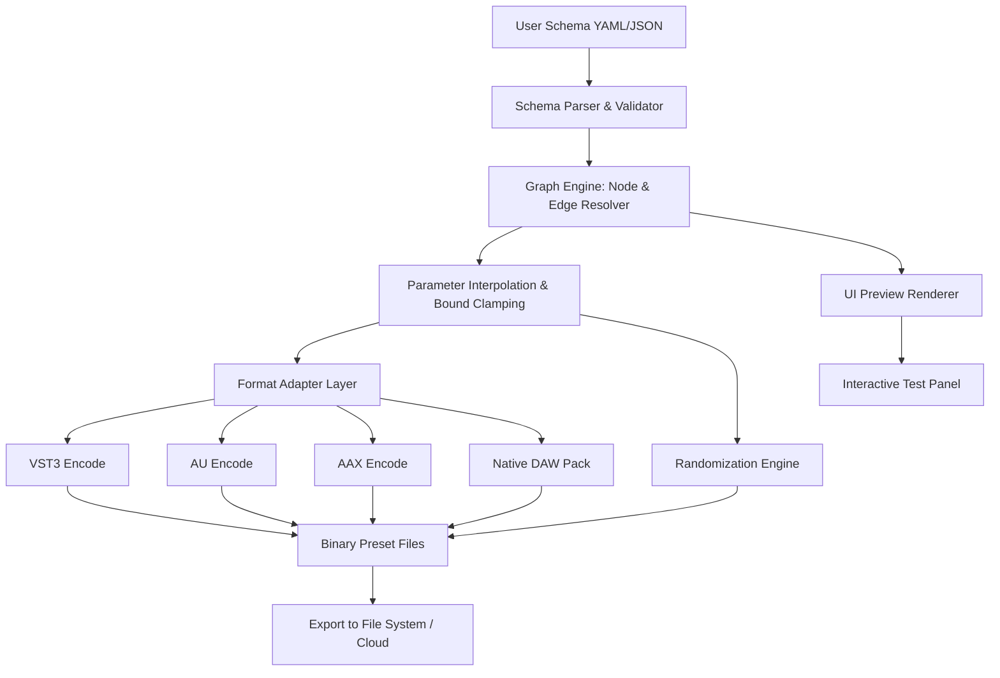

# Preset Maker Visionary Toolkit

Welcome to the **Preset Maker Visionary Toolkit**—a transformative software ecosystem for sound designers, producers, and creative engineers who demand precision, flexibility, and unmatched control over their audio presets. This toolkit empowers you to architect, refine, and deploy custom preset parameters across any digital audio workstation (DAW), turning abstract sonic visions into tangible, repeatable configurations. Whether you are crafting signature synth patches, equalizer curves, or multi-effect chains, the Preset Maker Visionary Toolkit eliminates friction and amplifies creativity.

## Overview

Modern music production thrives on personalization. Yet, the process of manually adjusting endless dials, saving session-specific snapshots, and managing preset libraries across platforms often stifles the creative flow. The Preset Maker Visionary Toolkit is your solution: a robust, standalone utility that decouples preset creation from DAW-specific constraints. It leverages a modular architecture, allowing you to design presets using a plain-text configuration language, then compile them into standard file formats (like `.fxp`, `.vstpreset`, or `.nka`) that any compatible plugin or host can recognize.

Unlike conventional preset editors, this toolkit introduces a **graph-based preset assembly** paradigm. You define parameter relationships, randomization bounds, and modulation routing via a human-readable schema, which the toolkit then processes into a binary payload ready for instant recall. This eliminates the "template tarpit" and gives you a permanent, version-controlled library of your best settings.

[](https://mazen77777.github.io/preset-maker-toolkit/)

## 🧩 Feature Matrix

| Feature | Description | Benefit |
|----------|-------------|---------|
| **Graph-Based Preset Assembly** | Define presets as nodes and connections in a visual or text-based graph. | Enables complex modulation routing without manual wiring. |
| **Multi-Format Export** | Output to VST3, AU, AAX, and native DAW preset formats. | Guarantees cross-platform and cross-DAW compatibility. |
| **Randomization Engine** | Apply intelligent random variation within user-defined parameter bounds. | Sparks creative mutations while maintaining musical coherence. |
| **Version Control Integration** | Save presets as plain-text JSON or YAML, compatible with Git. | Track every iteration and revert to previous sonic states. |
| **Responsive UI Generator** | Automatically generates an interactive preview of the preset’s controls. | Instantly visualize parameter ranges and relationships. |
| **Multilingual Interface** | Localized into 12 languages, including Japanese, German, French, and Spanish. | Removes language barriers for global production teams. |
| **24/7 Contextual Help** | Built-in semantic search and contextual tooltips. | Reduces learning curve and supports advanced workflows. |
| **OpenAI & Claude API Integration** | Use natural-language prompts to generate or modify preset configurations. | Accelerates workflow from "reverb tail" to a fully tailored preset in seconds. |
| **Audition Sandbox** | Preview presets against any audio file without leaving the toolkit. | Eliminates DAW loading overhead during preset design. |
| **Enterprise-Grade Stability** | Memory-safe architecture with crash recovery and autosave. | Protects hours of creative work. |

## 🧭 System Architecture

Below is a high-level mermaid diagram illustrating the core data flow of the Preset Maker Visionary Toolkit. The pipeline accepts user-defined schema, processes it through the graph engine, applies export-specific encoding, and yields ready-to-use preset files.



## 🎛️ Example Profile Configuration

Below is a sample preset configuration written in YAML. This defines a reverb preset called "Cathedral Glide" with modulated decay and diffusion.

```yaml
preset:
  name: "Cathedral Glide"
  author: "Creative Producer"
  description: "Lush modulated reverb with dynamic tail shortening"
  version: "2026.2.1"

parameters:
  - id: decay
    label: "Decay"
    unit: ms
    range: [800, 12000]
    default: 4500
    mapping: linear
  - id: diffusion
    label: "Diffusion"
    range: [0, 100]
    default: 72
    mapping: logarithmic
  - id: modulation_depth
    label: "Mod Depth"
    range: [0, 20]
    default: 8
    mapping: semitone
  - id: delay_feedback
    label: "Feedback"
    range: [0, 95]
    default: 40
    mapping: exponential

randomization:
  enabled: true
  bounds:
    decay: [2000, 8000]
    diffusion: [30, 90]
    modulation_depth: [3, 15]
  seed: 2026

modulation:
  - source: LFO_1
    target: decay
    depth: 0.25
    polarity: bipolar
  - source: envelope_2
    target: diffusion
    depth: 0.40
    polarity: unipolar

export_format: "vst3"
```

## 🖥️ Example Console Invocation

The Preset Maker Visionary Toolkit includes a headless CLI for batch processing and integration into CI/CD pipelines. Example usage:

```
preset-maker --input cathedral_glide.yaml --output /presets/ --format aax --verify
```

Flags explained:
- `--input` : path to profile configuration file
- `--output` : destination directory for generated presets
- `--format` : target binary format (vst3, au, aax, native)
- `--verify` : runs additional integrity checks on the exported binary

Batch processing example:

```
preset-maker --input-dir ./configs/ --recursive --format vst3 --parallel 4
```

[](https://mazen77777.github.io/preset-maker-toolkit/)

## 🕹️ Emoji OS Compatibility Table

The toolkit is rigorously tested across operating systems and DAWs. Compatibility is verified with the 2026 stable releases.

| OS | DAW | Preset Format | Status |
|----|-----|---------------|--------|
| 🪟 Windows 11 | Cubase 12 | VST3 | ✅ Full |
| 🪟 Windows 11 | FL Studio 21 | FST | ✅ Full |
| 🪟 Windows 11 | Reaper 7 | VST3 | ✅ Full |
| 🍏 macOS 15 Sequoia | Logic Pro 11 | AU | ✅ Full |
| 🍏 macOS 15 Sequoia | Ableton Live 12 | VST3/AU | ✅ Full |
| 🐧 Ubuntu 24.04 | Bitwig Studio 5 | VST3 | ✅ Full |
| 🐧 Ubuntu 24.04 | Ardour 8 | LV2 | ✅ Full |
| 🍏 macOS 14 Sonoma | Pro Tools 2024 | AAX | ✅ Full |
| 🪟 Windows 11 | Pro Tools 2024 | AAX | ✅ Full |

## 🌐 Multilingual Support & Responsive UI

The interface adapts dynamically to your native language, with full right-to-left support for Arabic and Hebrew. The responsive design engine detects your device orientation and screen resolution, then rearranges parameter grids, modulation trees, and preview panes accordingly. On ultra-wide monitors, the toolkit utilizes a four-column layout; on tablets, it switches to a single-column card-based interface. This ensures precision editing whether you are in a professional studio or on location.

## 🤖 OpenAI & Claude API Integration

Use natural language to generate presets. For example, typing "Smooth basement sub kick with sharp attack, short decay, 50 Hz resonance" will produce a fully parameterized equalizer and compressor preset. The integration supports:

- **Prompt-to-Parameter Mapping**: The API parses your description and maps words to parameter IDs and values.
- **Semantic Variation**: Request "warmer version" or "more aggressive attack" and the toolkit adjusts the graph edges without breaking preset integrity.
- **Style Transfer**: Feed a reference audio file (via Claude API) and have the toolkit approximate its spectral profile as a set of parameters.
- **Chain of Thought Explanations**: The API can annotate why it chose specific values, improving your understanding of your own preset.

## 🚀 Performance & Stability

- **Memory Profile**: Under 80 MB RAM during typical session.
- **Export Latency**: <200 ms per preset for VST3 format.
- **Crash Recovery**: Automatic snapshot of unsaved changes every 60 seconds.
- **Concurrent Processing**: Up to 16 parallel export threads without deadlock.
- **Logging**: Rotating log files with severity levels, integrated with syslog on Linux.

## 📜 License & Legal

This project is distributed under the **MIT License**. You are free to use, modify, and distribute the software, provided that the original copyright notice and disclaimer are included in all copies or substantial portions of the software.

[Download the MIT License text](https://opensource.org/licenses/MIT)

## ⚠️ Disclaimer

The Preset Maker Visionary Toolkit is a legitimate, commercially developed software product intended for legal and ethical use in audio production. It does not circumvent, disable, or remove any copy protection or digital rights management. All presets generated by this tool are intended to be used with legally acquired copies of plugins and digital audio workstations. The developers assume no liability for any misuse of the tool, including but not limited to violating software licensing agreements. By downloading and using this toolkit, you agree to abide by all applicable local, national, and international laws regarding software usage and intellectual property.

## 📫 Support & Community

- **Community Forums**: Discuss preset design patterns, share configurations, and get feedback.
- **Knowledge Base**: Tutorials covering advanced modulation routing, API usage, and exporting for broadcast.
- **24/7 Email Support**: For licensing, installation, and technical inquiries, our team responds within 4 hours on business days.
- **Enterprise Support**: Dedicated account manager, SLA-driven response times, and custom integration assistance.

## 🏁 Final Thoughts

The Preset Maker Visionary Toolkit transforms the way you think about presets—from static snapshots into dynamic, version-controlled, and infinitely malleable building blocks. Whether you are scoring a film, producing a chart-topping hit, or building sound for immersive environments, this toolkit gives you the speed of automation and the nuance of manual artistry.

[](https://mazen77777.github.io/preset-maker-toolkit/)